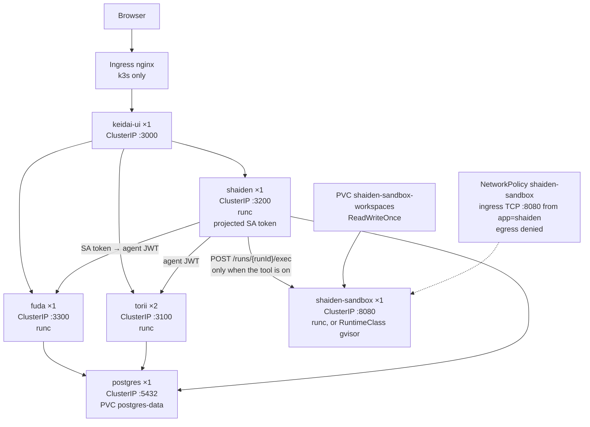
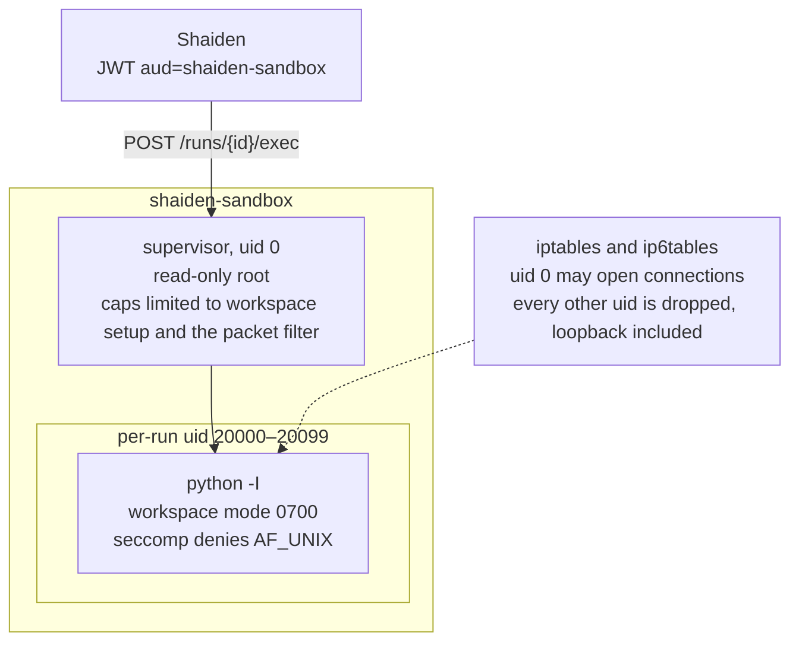

# Sandboxing

Model-written Python runs in `shaiden-sandbox`, a separate container. Shaiden
stays the agent runtime. The sandbox never receives Torii credentials or
backend secrets. Shaiden calls it with a short-lived Fuda JWT
(`aud=shaiden-sandbox`) only when `SHAIDEN_SANDBOX_URL` is set. Unset, the
`execute_python` tool is omitted.

The tool runs stdlib Python in that run's workspace. Files written there stay
until the run ends, including across an approval wait. Every process started
by a call is killed before the call returns. There is no network and no
package install.

## Cluster

The sandbox Deployment is always installed. On k3s the Python tool and the
gVisor RuntimeClass turn on together with `shaiden.sandbox.gvisor`. Until
then the pod stays on runc and Shaiden has no sandbox URL.
`shaiden.sandbox.allowRunc` turns the tool on and leaves the pod on runc, so
it shares the host kernel with Torii and Fuda. Torii, Fuda, and Shaiden never
take that RuntimeClass. The sandbox ServiceAccount token is not mounted.

Compose turns the tool on against a runc container. kind and OrbStack leave
the tool off and schedule the Deployment on runc. The image is the same on
every path. Node setup for `runsc` (systrap, no KVM) is in
[Install on k3s](../deploy/k8s/install-k3s.md#gvisor-for-the-sandbox).

## One call

Shaiden supplies the run id. The supervisor is root inside the container so it
can create the workspace, drop to a per-run uid, and install the packet
filter. The interpreter is the per-run uid, with no capabilities.

gVisor, when enabled, wraps this pod. It gives the sandbox a user-space kernel
so a bug in that kernel stays off the node that runs Torii and Fuda.

| Fence                                  | Effect                                                                                                                        |
| -------------------------------------- | ----------------------------------------------------------------------------------------------------------------------------- |
| NetworkPolicy                          | Ingress is TCP :8080 from pods labeled `app=shaiden`. Egress is empty.                                                        |
| Packet filter                          | The supervisor (uid 0) may fetch Fuda's JWKS. The interpreter may not open a connection, including to `127.0.0.1`.            |
| gVisor `runsc`                         | On k3s with `shaiden.sandbox.gvisor`, this pod's kernel is gVisor's. Platform is systrap.                                     |
| Per-run uid, mode `0700`               | One run cannot read another's workspace. Uids come from a fixed pool, `20000`–`20099`.                                        |
| `python -I` and a stripped environment | No user site, no bytecode, `HOME` and temp dirs are the workspace. `/tmp` and `/dev/shm` are not writable by the interpreter. |
| seccomp                                | `AF_UNIX` `socket` and `socketpair` return `EPERM`.                                                                           |
| Process-group kill                     | Children are reaped before the HTTP call returns, then any leftover pid of that uid is scanned and killed.                    |

The supervisor's added capabilities are `SETUID`, `SETGID`, `CHOWN`, `FOWNER`,
`DAC_OVERRIDE`, and `NET_ADMIN`. `allowPrivilegeEscalation` is false and the
root filesystem is read-only. The child does not inherit those capabilities.

## Lifetime

A workspace is created on the first exec for a run and deleted when the run
reaches a terminal outcome. A sweeper retries that delete if the completion
path misses it, and removes a workspace whose run is gone. A parked run keeps
its files. The volume is ReadWriteOnce, so the sandbox stays on one node.
